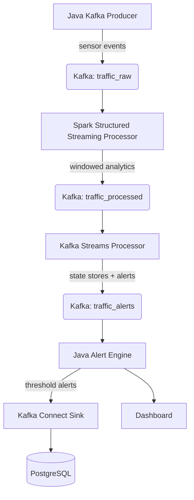

# Real-Time Traffic Monitoring & Alerting System

**Kafka + Java + Spark Structured Streaming**

A distributed, real-time traffic analytics platform that ingests live sensor data, processes it with Spark Structured Streaming, and generates actionable alerts — built entirely in Java.

- [Real-Time Traffic Monitoring \& Alerting System](#real-time-traffic-monitoring--alerting-system)
  - [Overview](#overview)
    - [Tech Stack](#tech-stack)
  - [Architecture](#architecture)
    - [Data Flow](#data-flow)
  - [Core Concepts](#core-concepts)
    - [Sliding Window Aggregation](#sliding-window-aggregation)
    - [Congestion Score](#congestion-score)
    - [Alert Rules](#alert-rules)
  - [Project Structure](#project-structure)
  - [Epics \& Roadmap](#epics--roadmap)
  - [Pseudo-Teacher Agent](#pseudo-teacher-agent)
    - [What it does](#what-it-does)
    - [How to use it](#how-to-use-it)
  - [Documentation](#documentation)

---

## Overview

This project simulates a city-scale traffic monitoring pipeline. Sensors placed along road segments emit vehicle count and speed data every second. A Java-based Kafka producer pushes those events into a streaming pipeline where Spark Structured Streaming computes sliding-window analytics and congestion scores. When congestion exceeds a configurable threshold, an alert engine fires notifications to a dedicated Kafka topic.

The system is designed for **scalability** (partition Kafka topics, scale Spark executors horizontally), **fault tolerance** (watermarking, idempotent consumers), and **high-throughput** event processing — all production-grade concerns wrapped in a clean, portfolio-ready architecture.

### Tech Stack

| Layer | Technology |
|---|---|
| Event streaming | Apache Kafka (KRaft or Zookeeper), Schema Registry |
| Stream processing | Apache Spark Structured Streaming (Java API), Kafka Streams |
| Ingestion & alerting | Java (Kafka client, Kafka Connect, Spring Boot optional) |
| Serialization | Avro, JSON, Protobuf |
| Security | SSL encryption, SASL/SCRAM authentication, ACLs |
| Storage | PostgreSQL (sink connector), MongoDB (optional), Delta Lake (optional) |
| Dashboard | Spring Boot + Thymeleaf or React (optional) |
| Deployment | Docker / Docker Compose, Kubernetes (optional), GitHub Actions CI/CD |
| Monitoring | Prometheus + Grafana, JMX metrics |
| Testing | JUnit 5, Testcontainers, Embedded Kafka |

---

## Architecture



### Data Flow

1. **Ingestion** — The Java producer emits JSON sensor events (`sensor_id`, `road_segment`, `vehicle_count`, `avg_speed`, `timestamp`) to `traffic_raw`.
2. **Processing** — Spark reads from `traffic_raw`, applies a 10-second sliding window (5-second slide), computes average speed and congestion score per road segment, and writes results to `traffic_processed`.
3. **Kafka Streams** — A Kafka Streams application consumes `traffic_processed`, maintains state stores for congestion trends, and emits alerts to `traffic_alerts` using exactly-once semantics.
4. **Alerting** — A Java consumer reads `traffic_alerts`, evaluates threshold rules, and publishes alerts (`road_segment`, `alert_type`, `severity`, `timestamp`) to `traffic_alerts`. Alerts are routed to Kafka Connect sink (PostgreSQL) and dashboard API.
5. **Kafka Connect** — Source connector ingests road metadata from PostgreSQL into Kafka. Sink connector persists alerts into PostgreSQL.
6. **Visualization** — An optional dashboard subscribes to both `traffic_processed` and `traffic_alerts` for real-time display.

---

## Core Concepts

### Sliding Window Aggregation

Spark groups events into overlapping time windows. A 10-second window with a 5-second slide means each event appears in two consecutive windows, providing smooth averages that react to changing conditions without abrupt jumps.

### Congestion Score

A normalized score (0.0 – 1.0) derived from:

```
congestion_score = (max_speed - window_avg_speed) / max_speed
```

A score of 0.8 means traffic is moving at 20% of the road's designed speed — heavy congestion. A score near 0 means free flow.

### Alert Rules

The alert engine evaluates simple threshold logic: when `congestion_score` exceeds a configurable limit (e.g., 0.7), it emits a `CONGESTION` alert with severity `HIGH`. Additional rules can detect speed drops, vehicle spikes, or anomalous patterns.

---

## Project Structure

```
traffic-system/
├── producer/
│   └── Producer.java              # Kafka producer — emits sensor events
├── spark/
│   ├── StreamingJob.java          # Spark Structured Streaming job
│   └── ml_models/                 # Optional ML models (anomaly detection)
├── streams/
│   └── TrafficStreamsApp.java      # Kafka Streams processor
├── alert_engine/
│   └── AlertConsumer.java         # Kafka consumer + rule evaluation
├── connect/
│   ├── source-config.json         # Kafka Connect source (PostgreSQL → Kafka)
│   └── sink-config.json           # Kafka Connect sink (Kafka → PostgreSQL)
├── dashboard/
│   └── DashboardApplication.java  # Optional Spring Boot dashboard
├── observability/
│   ├── prometheus.yml             # Prometheus scraper config
│   └── grafana_dashboards/        # Grafana dashboard JSON
├── tests/
│   ├── EmbeddedKafkaTests.java    # Unit tests with Embedded Kafka
│   └── StreamsTopologyTests.java  # Kafka Streams topology tests
├── config/
│   └── kafka_topics.json          # Topic configuration
└── docker-compose.yml             # Full system orchestration
```

---

## Epics & Roadmap

| # | Epic | Stories | Priority | Sprints |
|---|---|---|---|---|
| 1 | Kafka Infrastructure & Topic Management | 3 | Critical | 1-2 |
| 2 | Java Kafka Producer (Data Ingestion) | 3 | Critical | 2-3 |
| 3 | Spark Structured Streaming Processor | 5 | High | 3-4 |
| 4 | Kafka Streams Processor (Real-Time Alerting) | 4 | High | 4-5 |
| 5 | Java Alert Engine & Business Rules | 3 | High | 5-6 |
| 6 | Kafka Connect Integration | 3 | Medium | 6-7 |
| 7 | Dashboard (Spring Boot + React) | 4 | Medium | 7-9 |
| 8 | Security Implementation | 3 | High | 3-5 |
| 9 | Observability & Monitoring | 4 | Medium | 6-8 |
| 10 | Testing Framework | 4 | High | 4-7 |
| 11 | Deployment & CI/CD | 3 | Medium | 8-10 |
| 12 | Documentation & Knowledge Transfer | 3 | Medium | 9-10 |

See [`project-epics.md`](project-epics.md) for full user stories and definitions of done.

---

## Pseudo-Teacher Agent

This repo includes a custom **OpenCode agent** called `pseudo-teacher` that teaches every concept in this project using annotated pseudo-code — never real, runnable code.

### What it does

- Explains Kafka producers, Spark streaming windows, congestion scoring, and alert rules through **pseudo-code blocks** with line-by-line annotations
- Builds concepts incrementally: simple → complex
- Highlights common pitfalls and explains *why* they happen
- Uses analogies and real-world parallels to make abstract ideas concrete

### How to use it

1. Open this project in OpenCode
2. Switch to (or invoke) the `pseudo-teacher` agent
3. Ask about any concept — e.g., *"How does the sliding window work?"* or *"Explain the congestion score formula"*
4. The agent responds with annotated pseudo-code and plain-English explanations

The agent is defined at `.opencode/agent/pseudo-teacher.md`.

---

## Documentation

| Document | Description |
|---|---|
| [`project-overview.md`](project-overview.md) | Full architecture overview (Java stack) |
| [`project-epics.md`](project-epics.md) | User stories with definitions of done |
| [`Certified_Developer_Apache_Kafka.md`](Certified_Developer_Apache_Kafka.md) | Confluent Certified Developer exam outline |
| `.opencode/agent/pseudo-teacher.md` | Pseudo-code learning agent |
