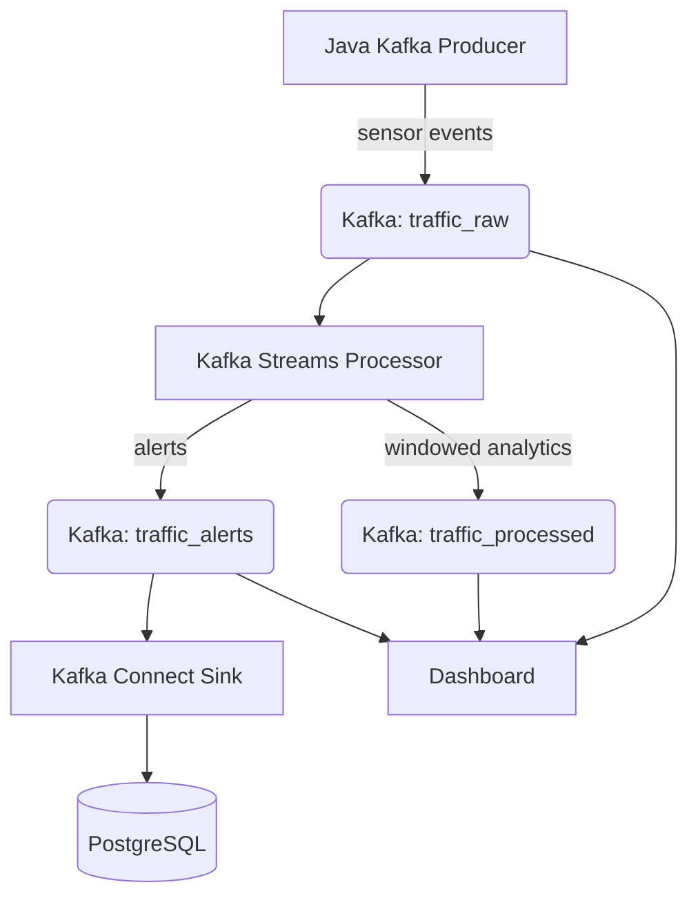

# Real-Time Traffic Monitoring & Alerting System

**Kafka + Java + Kafka Streams + Kafka Connect**

A distributed, real-time traffic analytics platform that ingests live sensor data, processes it with Kafka Streams, and generates actionable alerts — built entirely in Java.

## Overview

This project simulates a city-scale traffic monitoring pipeline. Sensors placed along road segments emit vehicle count and speed data every second. A Java-based Kafka producer pushes those events into a streaming pipeline where Kafka Streams computes windowed analytics and congestion scores. When congestion exceeds a configurable threshold, alerts fire to a dedicated Kafka topic. Kafka Connect bridges PostgreSQL for road metadata and alert persistence.

The system demonstrates all six Confluent Certified Developer exam sections in a single, cohesive architecture.

### Tech Stack

| Layer | Technology |
|---|---|
| Event streaming | Apache Kafka (KRaft mode), Schema Registry |
| Stream processing | Kafka Streams (Java) |
| Ingestion & alerting | Java (Kafka client, Kafka Connect) |
| Serialization | Avro, JSON |
| Security | SSL encryption, SASL/SCRAM authentication, ACLs |
| Storage | PostgreSQL (via Kafka Connect) |
| Dashboard | Spring Boot + Thymeleaf |
| Deployment | Docker / Docker Compose, GitHub Actions CI/CD |
| Monitoring | Prometheus + Grafana, JMX metrics |
| Testing | JUnit 5, Testcontainers, Embedded Kafka |

---

## Architecture



### Data Flow

1. **Ingestion** — The Java producer emits JSON sensor events (`sensor_id`, `road_segment`, `vehicle_count`, `avg_speed`, `timestamp`) to `traffic_raw`.
2. **Processing** — Kafka Streams reads from `traffic_raw`, applies a 10-second tumbling window, computes average speed and congestion score per road segment, and writes results to `traffic_processed`.
3. **Alerting** — When `congestion_score` exceeds 0.7, the Streams app emits a `CONGESTION` alert with severity `HIGH` to `traffic_alerts`.
4. **Persistence** — Kafka Connect source brings road metadata from PostgreSQL into Kafka. Kafka Connect sink persists alerts back to PostgreSQL.
5. **Visualization** — A Spring Boot dashboard polls the REST API and displays current traffic conditions and active alerts.

---

## Core Concepts

### Congestion Score

A normalized score (0.0 - 1.0) derived from:

```
congestion_score = (max_speed - window_avg_speed) / max_speed
```

A score of 0.8 means traffic is moving at 20% of the road's designed speed — heavy congestion. A score near 0 means free flow.

### Exactly-Once Semantics

Kafka Streams uses `processing.guarantee=exactly_once_v2` to ensure no alerts are duplicated or lost, even under failure conditions.

### State Stores

Kafka Streams maintains in-memory and persistent state stores for historical congestion data per road segment, enabling windowed aggregations and trend analysis without external databases.

---

## Project Structure

```
traffic-system/
├── producer/
│   └── Producer.java              # Kafka producer — emits sensor events
├── streams/
│   └── TrafficStreamsApp.java      # Kafka Streams processor + alerting
├── connect/
│   ├── source-config.json         # Kafka Connect source (PostgreSQL -> Kafka)
│   └── sink-config.json           # Kafka Connect sink (Kafka -> PostgreSQL)
├── dashboard/
│   └── DashboardApplication.java  # Spring Boot dashboard
├── observability/
│   ├── prometheus.yml             # Prometheus scraper config
│   └── grafana_dashboards/        # Grafana dashboard JSON
├── tests/
│   ├── EmbeddedKafkaTests.java    # Unit tests with Embedded Kafka
│   └── StreamsTopologyTests.java  # Kafka Streams topology tests
├── config/
│   └── kafka_topics.json          # Topic configuration
└── docker-compose.yml             # Full system orchestration
```

---

## Epics & Roadmap

| # | Epic | Stories | Priority | Sprints |
|---|---|---|---|---|
| 1 | Kafka Infrastructure & Topic Management | 3 | Critical | 1-2 |
| 2 | Java Kafka Producer (Data Ingestion) | 3 | Critical | 2-3 |
| 3 | Kafka Streams Processor (Processing + Alerting) | 4 | High | 3-5 |
| 4 | Kafka Connect Integration | 3 | Medium | 5-6 |
| 5 | Dashboard (Spring Boot) | 3 | Medium | 6-7 |
| 6 | Security Implementation | 3 | High | 3-5 |
| 7 | Observability & Monitoring | 3 | Medium | 6-8 |
| 8 | Testing, Deployment & Documentation | 5 | High | 7-9 |

**Total estimate: 223 - 356 hours** (high end well under 450)

See [`project-epics.md`](project-epics.md) for full user stories and definitions of done.

---

## Certification Coverage

All six Confluent Certified Developer exam sections are covered:

| Exam Section | % | Project Coverage |
|---|---|---|
| Kafka Fundamentals | 23% | Epics 1, 6 — Topics, partitions, offsets, replication, CLI, security |
| Application Development | 28% | Epics 2, 3, 5 — Producer, consumer, serialization, error handling |
| Kafka Streams | 12% | Epic 3 — State stores, windowing, exactly-once, KTables |
| Kafka Connect | 15% | Epic 4 — Source and sink connectors, CDC concepts |
| Application Testing | 8% | Epic 8 — Embedded Kafka, Testcontainers, topology tests |
| Application Observability | 13% | Epic 7 — JMX metrics, Prometheus, Grafana |

---

## Documentation

| Document | Description |
|---|---|
| [`project-overview.md`](project-overview.md) | Full architecture overview |
| [`project-epics.md`](project-epics.md) | User stories with definitions of done |
| [`Certified_Developer_Apache_Kafka.md`](Certified_Developer_Apache_Kafka.md) | Confluent Certified Developer exam outline |
